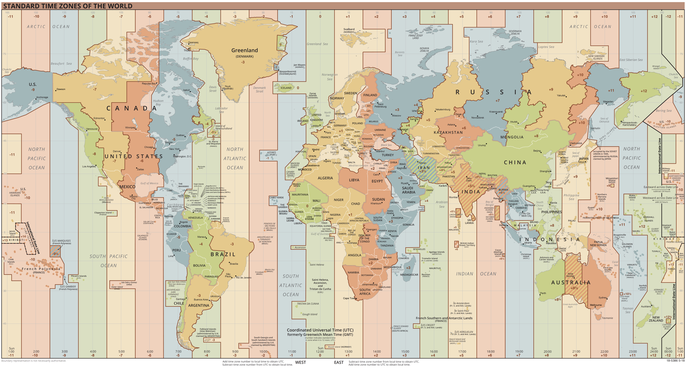
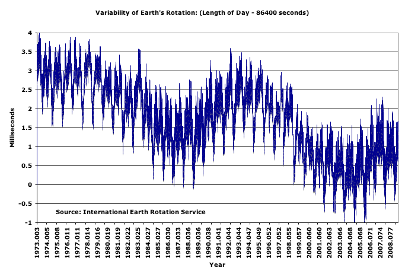
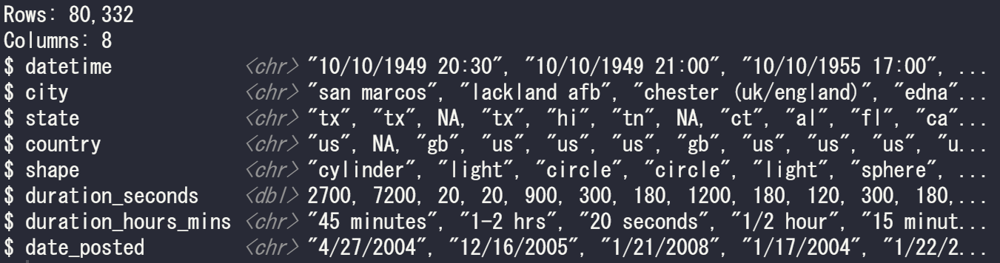

# `lubridate` Tutorial 
## Learn how to work with dates and times in R using the package `lubridate`.
<br>
Created by Sian Phillips in 2021 [last updated 20/10/24]
<br>

#### How to begin:

- Make sure you have access to R Studio or some other R environment on your computer.

- Clone this [repository](https://github.com/sian-phillips-1/date-time-tutorial-R/tree/main) or download the zip file.

- Take a look at the [`lubridate` cheat sheet](https://github.com/sian-phillips-1/date-time-tutorial-R/blob/main/cheatsheets/lubridate.pdf) (it could be useful to refer to it throughout the tutorial).

- Remind yourself of key `dplyr` functions for data wrangling ([`dplyr` cheat sheet](https://github.com/sian-phillips-1/date-time-tutorial-R/blob/main/cheatsheets/dplyr.pdf)).

- Please make sure you load the following packages into your R script. If you do not have them installed you will need to install them.

  ```R
  # install.packages("lubridate")
  # install.packages("ggplot2")
  # install.packages("dplyr")
  
  library(lubridate)
  library(ggplot2)
  library(dplyr)
  ```

<br>

### Prerequisites

This tutorial assumes as base knowledge of R. If you are new to coding in R or would like to consolidate your understanding check out; "Introduction to R" parts 1 and 2 and "Basic Data Manipulation" from the [Coding Club tutorials](https://ourcodingclub.github.io/tutorials.html) as these should provide a good starting point. You should also feel comfortable using the `ggplot` package to create graphs. 

Introduction to R: Part 1: [https://ourcodingclub.github.io/tutorials/intro-to-r](https://ourcodingclub.github.io/tutorials/intro-to-r)

Introduction to R: Part 2: [https://ourcodingclub.github.io/tutorials/troubleshooting](https://ourcodingclub.github.io/tutorials/troubleshooting)

Basic data manipulation: [https://ourcodingclub.github.io/tutorials/data-manip-intro](https://ourcodingclub.github.io/tutorials/data-manip-intro)

Data visualisation: Part 1: [https://ourcodingclub.github.io/tutorials/datavis](https://ourcodingclub.github.io/tutorials/datavis)

> Coding Club is a community of data science ecologists based at the University of Edinburgh that provide a fun and friendly coding experience for everyone. 

### Tutorial format 

This tutorial will begin by explaining types of date-time in R and their class. We will then cover the basic functions of the `lubridate` package and how to use them. Once we have build this foundation we will learn how to work with date-time elements  in a real dataset.

When working with the dataset there will be blanks in the code for you to fill in. I encourage you to try and test yourself, so resist scrolling back through the tutorial. Try to work from memory and only look back when you are really stuck.  

#### Why are dates and times important for data science?

Dates and times are relevant to everything we do, they are ingrained in us, giving us a sense of order and structure. They can be used to quantify when exactly a certain event occurs and can help us understand chronological relationships. In data science, dates and times can be extremely useful when exploring, manipulating, modelling and visualising our data.

We all know what a date and time is, so working with them in a dataset should be easy, right? Let's find out. 

<br>

## Part 1: Building a foundation of knowledge

### What is `lubridate`?

Throughout the tutorial we will make use of a package from the `tidyverse` world called `lubridate`. 

> This package includes functions to work with date-times and time-spans. It is fast and user friendly helping with;
>
> - parsing of date-time data, 
>
> - extraction and updating of components of a date-time, 
> - algebraic manipulation on date-time and time-span objects. 
>
> The '`lubridate`' package has a consistent and memorable syntax that makes working with dates easy and fun.
>
> Doccumentation: [https://lubridate.tidyverse.org/index.html](https://lubridate.tidyverse.org/index.html)

### Date-time Class

Just as numbers and strings have their own class, so too does date-time. There are three types of date/time data:

| Type      | Class (Tibble) | Class                |
| --------- | -------------- | -------------------- |
| date      | `<date>`         | `"Date"`             |
| time      | `<time>`         | `"Period"`           |
| date-time | `<dttm>`        | `"POSIXct" "POSIXt"` |

The class of each date/time is displayed differently in a [tibble](https://tibble.tidyverse.org/) compared to how it is displayed in base R but they both mean the same thing and behave in the same way. 

"POSIXct" "POSIXt"  are date-time classes representing calendar dates and times.  There are built in POSIXt functions, however `lubridate` is easier to work with and uses more intuitive syntax. That isn't saying that  POSIXt functions aren't useful, for example if you only have times in your data set it might be easier just using POSIXct. You can read more about POSIXt [here](https://astrostatistics.psu.edu/su07/R/library/base/html/DateTimeClasses.html).

### Date format

There are many ways the write a date and date formats vary across the world. Having different formats could be confusing for people that come from different countries or planets (more on that later) to understand. The international standard recommends writing the date as year, then month, then the day: YYYY-MM-DD and this is exactly how it should appear in R. However in most cases we must convert these different ways of writing the date into the universal format.

### Parsing dates and times

Here we learn how to convert strings or numbers to date-times. The goal is to end up with a date-time in the form: "YYYY-MM-DD HH:MM:SS" 

With `lubridate` we can use a combination of the letters  'd', 'm', 'y' (standing for day, month, year) to parse the date. We simply match the letters to the pattern of the date we are trying to parse. 

Run the code yourself to see what the output of each function is. 

```R
ymd("20060319")

mdy("03-19-2006")

dmy("19/03/2006")
```

The phrase "UTC" in the output represents the time-zone and by default should be "UTC", this stands for universal time coordinated. More about time-zones later. 

There are a few more combinations of 'd', 'm', 'y' you can use see the `lubricate` cheat sheet for inspiration. However just stick to the rule of matching what you have in you dataset with the correct pattern of characters.

A very similar technique can be used to parse times:

```R
hms("20:30:10")
```

Now if we come across a variable that includes a date and time we join these characters together with an '_' to parse a date-time.

```R
mdy_hms("03/19/2006 20:30:10")
```

### Use an accessor function to get a component

If the date-time variable is successfully parsed as a date-time class then we can begin extracting components.  Each function will return a number corresponding the name of the function.  Run the code below to investigate.

```R
datetime <- mdy_hms("03-19-2006 20:30:10")

# Self explanatory date extractions
date(datetime)
year(datetime)
month(datetime)
day(datetime)

# Self explanatory time functions
hour(datetime)
minute(datetime)
second(datetime)

# Some iteresting extractions, explore what they do, use the help function in R studio to understand the parameters 
week(datetime)
quarter(datetime)
semester(datetime)
```

There are other extract functions in the `lubridate` cheat sheet and more elsewhere. 

### Assign into an accessor function to change a component in place

We can use these same functions to change components of a date-time. This only changes the component specified by the function all others components stay the same. Explore the what numbers work for the other functions, think what each number means in relation to the function.   

```R
# Two examples of setting a component
date(datetime) <- 5
hour(datetime) <- 14
```

What does the `update` function from `lubridate` do?

### Time zones

As you can see, in the time-zone map below, the distinction between zones along with the ever-changing geopolitical naming of territories can make fixing times for a specific location quite complicated. 

Run the function `OlsonNames()`to explore the approximately 600 time zones that R recognises.



There are two main functions from `lubridate` that can be used to play around with time-zones. They are;

- `with_tz` - This returns a date-time as it would appear in a different time zone. 
-  `force_tz` - This returns the date-time that has the same clock time as input time, but in the new time zone. This may sound confusing at first but play around with the following code until you understand and if you want you can read more about this function [here](https://lubridate.tidyverse.org/reference/force_tz.html).

In R, to avoid confusion with time zones that have the same name it is best practice to use the format "continent/city” when specifying time-zones. Here, 'city' should be a city in the desired time zone (e.g. use "Europe/Paris for any time zone in France"). 

The following code displays the scenario of an online exam for an Edinburgh university data science students starting at 13:00:00. The function `with_tz` tells us what time the exam would start for a student living in Perth, Australia. 

```R
online_exam <- ymd_hms("03-19-2006 20:30:10", tz = "Europe/London")
with_tz(online_exam, "Australia/Perth")
```

But what if the student thought the exam started at 13:00:00 Perth time? We use the  `force_tz` function here to set a new variable equal to 13:00:00 in Perth, then we use the `with_tz` function again to reveal what this time would have been in Edinburgh. 

```R
wrong_time <- force_tz(online_exam, "Australia/Perth")
with_tz(wrong_time, "Europe/London")
```

So if the student had got the wrong time they would have tried to start the exam at 18:00:00 UK time and thus would have missed it by 5 hours!

### Time spans

The package `lubridate` provides three classes, or three different ways, to distinguish between different types of time spans. We have;

- Periods 
  - represents human units like years and days.
  - records a time span in units larger than seconds
  - it allows us to perform calculations in calendar or clock time.
  - e.g. model events that happen at specific clock times, like the 1 o'clock gun in Edinburgh.
- Durations
  -  represents an exact number of seconds. 
  - doesn't include a start date.
  - e.g. model physical processes, like a race.
- Intervals 
  - represents a start and end point.
  - an Interval measures elapsed seconds between two specific points in time.
  - divide an interval by a duration to determine its physical length, divide an interval by a period to determine its implied length in calendar/clock time.
  - e.g. model a holiday which has a start and end date. 

Let's see how they work in R:

```R
start <- ymd_hms("20060120 20:30:10", tz = "Europe/London") # Create start time
end <- ymd_hms("20060316 05:05:05", tz = "Europe/London") # Create end time (after start time)
```

We can create an **interval** by using the `%--%` operator:

```R
(interval <- start %--% end) 
# You could also use, 
# interval <- interval(start, end)
str(interval)
```

Interval prints the start and end date-time. If we look at the structure of an Interval object we see it contains elapsed time in seconds (4696495) as well as the start date and the time zone. 

We can create a **duration** between the start and end date:

```R
(duration <- as.duration(interval))
str(duration)
```

Duration gives us the time in seconds between the start and end date. The structure function also return the elapsed time in seconds.

We can also create a **period** from an interval:

```R
(period <- as.period(interval))
str(period)
```

A Period prints elapsed time as integers in the form of years, months, weeks, days and so on. If we look at the structure we see a Period contains several slots for “clock time” values and, like the Duration object, no associated date.

### Date-time inherent problems

Time is a concept invented by humans, humans are not perfect, therefore time is not perfect. We can see this when we delve deeply into the make up of each time component. The universe, by design, has not made it easy for us. Due to the rotation and orbit of the earth, a year does not have exactly 365 days and every minute does not have exactly 60 seconds etc. etc.. These details do not make much difference over a short period of time, but, in the long run it can through things way off. Luckily, for us humans also have this habit of trying to fix problems. Hence, we have the invention of leap years, leap seconds, daylight saving etc etc.. 



These slight changes mean that when we want to do mathematics with times and dates we might run into a few problems. Thankfully, `lubridate` is here to help us out.

In 2020 the clocks went forward on the 29th of March at 1 am.  Lets see how this effects the time span between March 28th and March 29th:

```R
WT <- ymd_hms("20200328 20:00:00", tz = "Europe/London") # Start date and time in winter time
ST <- ymd_hms("20200329 20:00:00", tz = "Europe/London") # End date and time in summer time

(clocks_change <- WT %--% ST)
str(clocks_change)

(duration <- as.duration(clocks_change))
str(duration)

(period <- as.period(clocks_change))
str(period)
```

See if you can spot these observations in the output and then answer the respective questions:

- For the interval the time zone changes from GMT to BS, what do these abbreviations stand for?
- The duration of the interval is 23 hours instead of 24, why is that?
- Even though duration states that 23 hours have elapsed, why is the period of time exactly 1 day?  

Now that we know a little about how each time-span class interacts compares with each other, lets look at their individual attributes.

### `difftime`'s

Here we introduce a `difftime` object, these are a class of durations, obtained when finding the difference between two date-times. In base R a `difftime` can be measured in a range of  ways such as days or minutes. Whereas, in `lubridate` they are consistently measured only in seconds. 

```R
ww1 <- dmy("11 November 1918") - dmy("28 July 1914") 
```

This tells us that there is a time time difference of 1567 days between the start and end of World War 1. 

```R
as.duration(ww1)
```

This gives us the duration of the war in seconds and in brackets the approximate number of years. This format is more useful for doing calculations.

### Duration and period constructors

How to construct a duration or period;

| Duration                        | Period                   |
| ------------------------------- | ------------------------ |
| `dseconds(x)` :  x seconds      | `seconds(x)` : x seconds |
| `dminutes(x)` : 60x seconds     | `minutes(x)` : x minutes |
| `dhours(x)` : 3600x seconds     | `hours(x)` :  x hours    |
| `ddays(x)` : 86400x seconds     | `days(x)` : x days       |
| `dweeks(x)` : 604800x seconds   | `weeks(x)` : x weeks     |
| `dmonths(x)` : 2629800x seconds | `months(x)` : x months   |
| `dyears(x)` : 31536000x seconds | `years(x)` : x years     |

Where x can be a just a real number (positive or negative), a list such a `x = c(1,2,3)` or a range like `x = 1:5`.

e.g.

```R
(d <- dyears(9:15) + dmonths(5:11))
(p <- minutes(c(20,30,40)) + hours(c(2, 14,23)) + seconds(c(59,1,5)))
```

What happens for each time when x is a fraction? What happens when x is a negative number?

*Note:* with durations, be careful, months don't have a consistent number of seconds, neither do years. 

### Explore intervals

Lets work a bit more with `lubridate`'s interval functions. We will use an example of Jack and Jill's holiday dates for 2021. 

```R
# Create an interval, set the start and end dates of each of their holidays 
jack_holiday <- ymd("2021-05-05") %--% ymd("2021-06-23")
jill_holiday <- ymd("2021-06-04") %--% ymd("2021-06-29")

# Let's check if Jill's holiday lies within Jack's?
jill_holiday %within% jack_holiday

# Change the start time of Jill's holiday
int_start(jill_holiday) <- ymd(20210505) # Opposite is 'int_end'

# Check whether if the holidays share a boundary
int_aligns(jack_holiday, jill_holiday)

# What is the length of Jack's holiday in seconds
int_length(jack_holiday)

# Shift Jack's whole holiday forward by 5 days
int_shift(jack_holiday, days(5)) # Her if we use a negative number the the dates will shift backwards
```

### Arithmetic with classes of timespans

Doing maths with time spans should be quite simple however, back to the inconsistencies of time is quite simple. You do also need to be aware of what you can and can't do with each date-time element. 

The following image is a useful reminder of the arithmetic we can do with time spans in `lubridate`:

<p align="center">
  
  <br>
  <em>Fig: [R for Data Science, chapter 16, Hadley Wickham and Garrett Grolemund.](https://r4ds.had.co.nz/dates-and-times.html#summary-1)</em>
</p>    

**Let's see a few examples:**

**Ex. 1**

What would be the end date of the war if WW1 had lasted another 4 months and 10 days?

```R
ww1_end <- dmy("28 July 1914") 
ww1_end + days(10) + months(4) # Adding a date and two periods
```

**Ex.2**

We can multiply periods and durations by real numbers:

```
4 * (years(2) + months(6) + days(1))
9 * dyears(1)
```

**Ex.3**

We can also divide periods and durations. What do you notice about the output? Why are they different? 

```
dyears(1) / ddays(365)
years(1) / days(1)
```

There are many other calculations you can do with time spans, and often you will need do perform maths specific to your data. 

<br>

#### **Part One Summary:**

The main take-away from this section is that the package `lubridate` makes working with date and time much simpler and gives us neat little tricks for dealing with difficult date-time problems such as leap years and clock changes. There are other functions from the package that we had not covered. Functions that help you round date-times and a handy function that allows you to roll imaginary dates to the first day of the next month or the last day of the previous month. All of this is explored on the `lubridate` cheat sheet and the resources listed at the end of the tutorial. 

We have now covered the basics of `lubridate`. You should know how to :

- Parse date-times
- Extract date-time components
- Assign date-time components
- Work with time zones
- Work with time spans
- Do arithmetic with date-times and time spans.

<br>

## Part 2: Applying our knowledge

### Times and Dates in a Data frame

Now that we have gone over some of the basics for using date and time in R using the `lubridate` package, it is time to apply what we have learnt to a real dataset. 

For a while now a group of  Aliens have been constructing a dataset. This dataset contains important information about UFO sightings recorded by humans from across planet Earth. The Aliens are particularly interested in the dates and times of these UFO sightings and have some questions in regards to temporal aspects of the data. Although, across the universe, on numerous planets there exists technology we could only dream of, nothing in the universe compares to R Studio. Therefore, the aliens have beamed their most recent dataset down to earth in the hopes that a data scientist can help them out with their data. That data scientist is you...


**Important:** the following code contains gaps denoted by  '---' , please fill in the gaps in your own R script. The answers can be found [here]() in this completed R script. 

```R
# Import our data
ufo_sightings <- read_csv("ufo.csv")

# View data
View(ufo_sightings)
```

The Aliens are not interested in the location of the sightings or the comments so have asked you to remove the 'longitude', 'latitude' and 'comments' columns from the data frame.  We can also see in the dataset that a few column names have gaps in them, this could be considered poor etiquette, so we will also fix this.  We will create a new dataset called 'ufo' with these changes applied to the original imported data. 

```R
ufo <- ufo_sightings %>%
  select(---) %>%
  rename(date_posted = "date posted",
         duration_seconds = "---",
         duration_hours_mins = "duration (hours/min)")
```

Let us now investigate the dataset, in particular look closely at the class of each variable

```R
summary(ufo)
glimpse(ufo)
```

The output should look like this:



We can see that the variables 'datetime' and 'date_posted' are listed as characters. We would like to change the class of these columns to date-time. 

In the next section of code add a combination of letters to parse the date-time and date observations. 

```R
ufo <- ufo %>%
  mutate(datetime = ---(datetime),
         date_posted = ---(date_posted)) 
```

Now we can check the class of each of the new variables in both tibble and base R format: 

```R
class(ufo$datetime)
class(ufo$date_posted)
glimpse(ufo)
```

Great as we can see from the output we have successfully parsed the date-time columns!

### Extraction

In case in the future we might want to use just the date element of the variable 'datetime' we can **extract** this using a `lubridate` function. Can you remember what it is? 

```R
ufo <- ufo %>%
  mutate(date = ---(datetime))
```

### Time Zones

<div style="display: flex; align-items: right;">
<p>The Aliens are currently on a meditative retreat in Area 51 which is located just north-east of Las Vegas. They are are very interested in the concept of planet Earths time zones. To help them understand, they have asked that you create a new column called 'datetime_51'  that contains each sighting date-time in Nevada time.</p>
  
</div>

```R
ufo <- ufo %>%
  ---(datetime_51 = ---(datetime, tz = "---")) 

# Use any city in the same time zone as Nevada   
```

The Aliens have also expressed interest in a UFO sighting of a sphere that occurred in Edinburgh in 2012 on New Years Day. They claim this was a false report and that at this time they were recovering from New Years celebrations with some good food in Tokyo. They remember landing their spacecraft at exactly 6:45 am. Check that they are telling the truth by finding the date-time at which a UFO in the shape of a sphere was spotted in Edinburgh and work out what time this would have been in Tokyo. 

```R
edinburgh <- filter(ufo, --- == "edinburgh (uk/scotland)" --- shape == "---")

(ed_datetime <- ymd_hms(edinburgh$datetime)) # Here we don't need to specify 'tz' since the dates in the 
                                             # dataset are correct for their location.
(tokyo_datetime <- ---(ed_datetime, tz = "---"))
```

So the Aliens *were* telling the truth and a human in Edinburgh had made the whole thing up! Who would have thought. 

### Time spans

Let's work out the time spans between the sighting of the UFO and when the sighting information was posted. We will create three new columns with the interval, duration and period:

```R
ufo <- ufo %>%
  ---(time_interval = date --- date_posted,
         --- = as.duration(---),
         time_period = ---(---))
```

### Arithmetic

A useful variable could be a column that includes the end time of each UFO sighting. We can use some date-time arithmetic here to do so:

```R
ufo <- ufo %>%
  mutate(end_time = datetime + ---(duration_sighting_s))
```

Oops, the Aliens have informed us that some galactic cosmic rays managed to find their way into the data set. This somehow added exactly 5 days 5 minutes and 5 seconds to the date-time of each sighting. To correct this problem we have to remove this period to the current date-times that we have:

```R
ufo <- ufo %>%
  mutate(datetime = (datetime --- (days(---) --- minutes(---) --- seconds(---))))
```

View the dataset or use summary functions to check that these two pieces of code have done what you expected them to do.

### Visualise date-time distributions

Turns out Aliens love a good graph, don't we all! On request, we will answer some of the Aliens' burning questions in the form of a visualisation; 

1. What is the most popular day for a UFO sighting?

```R
year(ufo$date) <- 0 # We set the component years in 'date' equal to zero 
                    # becasue we are only interested in months and days.

ufo %>% 
  ggplot(aes(date)) + 
  geom_freqpoly(binwidth = 1) # Binwidth in this case is by day, we set equal to 1 becasue we want each                                   # timestep to be one day
```

We can see the largest spike out July time. If we use some summary functions then we can see that the most common day for UFO appearances is the 4th of July! You can read more about patriotic aliens [here](https://www.economist.com/graphic-detail/2019/07/04/are-extraterrestrials-extra-patriotic).

2.  What day of the week do most UFO sightings occur?

```R
ufo %>%
  mutate(wday = wday(datetime, label = TRUE)) %>% # wday extracts the week day element of the date-time 
  ggplot(aes(x = wday, fill = wday)) +
  geom_bar() +
  theme_bw()+
  xlab("Day of the Week") +
  ylab("Count")
```

The plots above are just to dive you an understanding of how to plot date-time data, so they don't look very pretty. If you wanted to you could use your `ggplot` beatifying skills to make them look nicer. 

### Congratulations

Well done for completing the tutorial, the aliens will be in contact if they need any more help with their datasets! 

After completing Part 1 and Part 2 of the tutorial you should now know how to work with date-time elements as well as date-time in a dataset. 

### Follow-up

If you fancy consolidating your date-time in R skills as well as incorporate some other data science disciplines such as modelling and visualisation then take inspiration from some of the ideas below.  

1. At which hour of the day are you most likely to spot a cylindrical UFO?

2. Does the time of the UFO sighting have an effect on duration? 

3. Create a map of the UFO sightings and distinguish each sighting by the shape of  the UFO. 

<br>

**Data Disclaimer**: The data used didn't actually come from an alien spacecraft, it came from a website called [kaggle](https://www.kaggle.com/). Kaggle is an online community of data scientists and machine learning practitioners and the website contains lots of very interesting and unique datasets. 

The data can be found [here](https://www.kaggle.com/NUFORC/ufo-sightings).

### Resources

**For using the package `lubridate`:**

[https://www.r-bloggers.com/2014/02/using-dates-and-times-in-r/](https://www.r-bloggers.com/2014/02/using-dates-and-times-in-r/)

[https://cran.r-project.org/web/packages/lubridate/vignettes/lubridate.html](https://cran.r-project.org/web/packages/lubridate/vignettes/lubridate.html)

[https://data.library.virginia.edu/working-with-dates-and-time-in-r-using-the-lubridate-package/](https://data.library.virginia.edu/working-with-dates-and-time-in-r-using-the-lubridate-package/)

[https://www.rdocumentation.org/packages/lubridate/versions/1.7.9.2](https://www.rdocumentation.org/packages/lubridate/versions/1.7.9.2)

[https://lubridate.tidyverse.org/index.html](https://lubridate.tidyverse.org/index.html)

[https://cran.r-project.org/web/packages/lubridate/lubridate.pdf](https://cran.r-project.org/web/packages/lubridate/lubridate.pdf)

**Additional Resources/Extra Reading:**

Time-zones database : [http://www.iana.org/time-zones](http://www.iana.org/time-zones)

Area 51: [https://en.wikipedia.org/wiki/Area_51](https://en.wikipedia.org/wiki/Area_51)

Our relationship with time: [https://www.bbc.com/future/article/20191203-what-we-get-wrong-about-time](https://www.bbc.com/future/article/20191203-what-we-get-wrong-about-time)

Problems with the Georgian calendar: [https://www.vox.com/2016/10/4/13147306/434th-gregorian-calendar-anniversary-google-doogle](https://www.vox.com/2016/10/4/13147306/434th-gregorian-calendar-anniversary-google-doogle)
